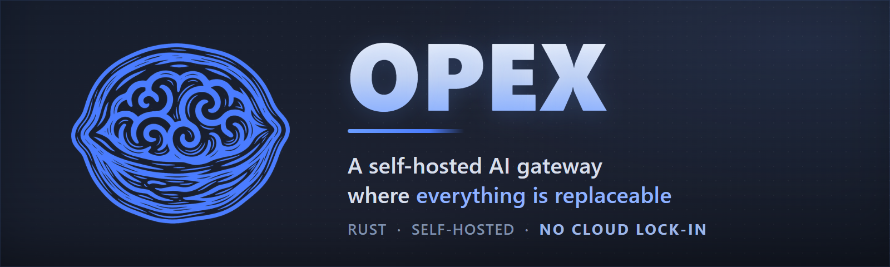

<h1 align="center">
  
</h1>

<p align="center">
  <a href="https://github.com/AronMav/opex/actions/workflows/ci.yml?branch=master"></a>
  <a href="https://github.com/AronMav/opex/releases"></a>
  <a href="LICENSE"></a>
  <a href="https://www.rust-lang.org/"></a>
  <a href="https://github.com/AronMav/opex/releases"></a>
</p>

<p align="center">
  <a href="README.ru.md">Русский</a> ·
  <a href="docs/">Docs</a> ·
  <a href="docs/ARCHITECTURE.md">Architecture</a> ·
  <a href="docs/API.md">API</a> ·
  <a href="SECURITY.md">Security</a>
</p>

**OPEX is a self-hosted AI agent platform ó always-on agents with long-term memory, reflection and identity, living in your chat apps. Built like infrastructure: a Rust core, not a chat wrapper.** A Rust core runs the HTTP API, agent lifecycle, LLM calls, tools, memory, scheduler and secrets on any Linux box ‚Äî x86_64 or ARM64, down to a Raspberry Pi-class board. Your agents live in Telegram, Discord, Slack, Matrix, IRC, WhatsApp and Email while working on your server ‚Äî with an encrypted secrets vault, SSRF-guarded tool calls, sandboxed code execution and a watchdog that messages you when something breaks.

Everything above the core is a file you can edit: an agent's persona is Markdown, a tool is ten lines of YAML, a skill is a Markdown note. Change the file — behavior changes. No rebuild, no restart.

---

## Install

```bash
tar xzf opex-v<VERSION>.tar.gz
cd opex
./setup.sh
```

The installer sets up Docker, Bun, Python 3, PostgreSQL, generates `.env`, and creates systemd services. When done, open `http://your-server:18789` — a 4-step wizard takes it from there.

From source: clone the repo and run `./setup.sh` — it detects missing toolchains and compiles. Requires Rust (toolchain pinned via `rust-toolchain.toml`), Node.js 22+, Docker, Bun 1.x, Python 3.

Updating later is one command: `~/opex/update.sh opex-v<VERSION>.tar.gz` — it preserves `.env`, `config/`, `workspace/` and the database.

---

## What's actually different

Self-hosted, multi-provider, web UI, RAG, voice, image generation, MCP — every project in this space has those, and so does OPEX. This list is what you *won't* find elsewhere:

| | |
| --- | --- |
| **Rust core** | The core is written in Rust (rustls only, no OpenSSL) — no Node or Python runtime in the hot path. Three Rust services — core, watchdog, memory worker — plus PostgreSQL 17 + pgvector; channel adapters (Bun) and the media hub (Python) run as supervised child processes, Docker hosts the sandbox and MCP containers. |
| **Security on by default** | Not plugins, not config flags — in the box and enabled: an authenticated-encryption vault (ChaCha20-Poly1305) that strips credentials out of configs, SSRF blocking at the DNS-resolver layer (immune to DNS-rebinding — not a URL-string check), default-on PII redaction that redacts rather than blocks, provenance tagging of untrusted content, Docker sandbox, deny-first tool policy. Full threat model below. |
| **Operations built in** | A separate watchdog binary alerts you in your own chat channel when an agent stalls or a process dies. Self-healing process supervisor, `/api/doctor` with 15 health checks (including a credential-leak scan of the workspace), one-click `pg_dump` backups. |
| **A model catalog that doesn't go stale** | Showing costs is common — the numbers usually come from a hand-maintained pricing file that lags reality. OPEX resolves context windows, prices and capabilities for thousands of models from a live external catalog (models.dev ∪ OpenRouter): per-session $ with cache and reasoning tokens tracked separately, provider presets with auto-filled URL / type / model list, request params gated by actual model capabilities. |
| **Memory you can read** | An agent's long-term memory is Markdown files — hand-editable, git-friendly, the source of truth. The rare part is the index behind them: pgvector + full-text + trigram search running in parallel in PostgreSQL, fused with RRF and MMR reranking, synced from the files automatically, in two tiers — raw with time decay and pinned permanent. |
| **Everything is a file** | Personas and skills are Markdown, tools are YAML (vault-backed auth, JSONPath transforms, OpenAPI import), all hot-reloaded. A built-in Curator retires stale skills and repairs broken ones on a schedule. |
| **Works unattended** | Cron with timezones and jitter and per-agent heartbeats are the baseline; the difference is the goal loop — a separate LLM-judge pass checks whether the stated goal is actually achieved, instead of stopping when the model stops calling tools. Results go to any channel; humans stay in the loop via approvals (countdown, editable arguments) and a mid-run `clarify` tool. |
| **A fleet, not a bot** | Agents in a shared session are always-alive peers — you (or another agent) can message, poll and kill them mid-conversation (ask / status / kill), not fire one-shot subagent runs. @-mention routing, a hard tool denylist for subagents with no recursive spawning, shadow-git checkpoints of agent workspaces with `/rollback`. |
| **Agents that carry context forward** | Opt-in, per-agent, default-off: an agent can keep an autobiographical memory — session events distilled into periodic reflections and a self-portrait file — and propose its own next steps between conversations (a daily plan advanced on a heartbeat, one owner tap to approve). Persona-drift detection can nudge an agent back toward its configured identity. All configured from the agent editor, all stored as inspectable rows and Markdown, none of it on by default. |

---

## Supported surfaces

| Surface | What works |
| --- | --- |
| **Channels** | Telegram, Discord, Slack, Matrix, IRC, WhatsApp, Email — one adapter process, pairing codes and allowlists, per-chat voice modes; slash commands come from a single registry — web autocomplete, native Telegram command menu, localized `/help`, file handlers exposed as commands |
| **LLM backends** | 30 provider types, one-click catalog presets, any OpenAI-compatible endpoint, local Ollama / vLLM, Claude CLI and Gemini OAuth as backends; per-agent routing rules with failover |
| **Media** | STT ×9 providers, TTS ×8, Vision ×8, ImageGen ×5, embeddings, web search (Brave / SearXNG / Ollama) — all behind one pluggable registry |
| **Standards** | MCP servers as on-demand Docker containers, OpenAPI ‚Üí tool import, OpenAI-compatible `/v1` API, LSP intelligence for agents (Python via pyright) |

---

## Security model

An agent with tools is an attack surface. OPEX treats that as a design input, not an afterthought:

| Threat | Mitigation |
| --- | --- |
| Credentials leak via configs or DB dumps | ChaCha20-Poly1305 vault; channel tokens are auto-extracted from configs and never stored in plaintext; `.env` holds exactly 3 keys |
| Agent-driven requests reach your LAN (SSRF) | DNS-level private-IP blocking — resolve first, then filter (RFC 1918, link-local, CGNAT, IPv6 ULA, Teredo, 6to4), closing DNS-rebinding |
| Untrusted code execution | Docker sandbox for non-base agents; deny-first tool policy checked before any allowlist; subagents inherit a hard denylist |
| Prompt injection via files and tool output | External content wrapped in `<file_output trust="untrusted">` provenance markers; PII (phones, emails, cards, API keys) redacted before LLM calls |
| A destructive tool call | Per-tool human approval with countdown and editable arguments; audit log; shadow-git checkpoint + `/rollback` |
| Brute force and hotlinking | Rate limiting with auth lockout; HMAC-signed expiring URLs for every file |
| Workspace escape | Path canonicalization and symlink resolution — an agent can't leave its directory |

> [!IMPORTANT]
> Back up `OPEX_MASTER_KEY` — it decrypts the vault and cannot be recovered if lost.

---

## Everything is a file

A new HTTP tool is one YAML file in `workspace/tools/` — available on the next request, no code, no restart:

```yaml
name: get_weather
description: "Current weather for a location (Open-Meteo)"
endpoint: "https://api.open-meteo.com/v1/forecast"
method: GET
parameters:
  latitude:  { type: number, required: true, location: query }
  longitude: { type: number, required: true, location: query }
response_transform: "$.current"
```

Auth comes from the vault (`bearer_env`, API key, header, OAuth refresh — 8 modes), responses can be trimmed with JSONPath, binary results route straight to the chat channel as photos or voice messages. Have an OpenAPI spec? Import it — each operation becomes a draft tool.

The same principle everywhere:

| Layer | Format | Takes effect |
| --- | --- | --- |
| Persona, memory, skills | Markdown | Next message |
| Tools | YAML | Next request |
| Agent config | TOML | Hot-reload (file watcher) |
| Providers, models | Registry in UI/API | Immediately |
| File handlers | Python plugins in toolgate | Hot-reload |
| Channels | Separate Bun process | On adapter reconnect |

---

## Architecture

```text
opex-core       — HTTP API, agent lifecycle, LLM calls, tool dispatch,
  │               memory, secrets, scheduler, model catalog
  ├── channels/ — chat adapters (TypeScript/Bun, managed process)
  └── toolgate/ — media hub: STT, TTS, Vision, ImageGen, Embeddings
                  (Python/FastAPI, managed process)

opex-watchdog        — external health monitor with channel alerting
opex-memory-worker   — background embedding reindex via a PostgreSQL queue

PostgreSQL 17 + pgvector — sessions, messages, memory, cron, secrets, usage
MCP servers / sandbox    — on-demand Docker containers
```

The Rust core knows no messaging protocol and ships no built-in provider SDK. Every external surface — channels, media services, LLM backends, MCP tools — sits behind a defined protocol boundary. That's what makes each layer replaceable without touching the core. See [docs/ARCHITECTURE.md](docs/ARCHITECTURE.md).

---

## Configuration

Three variables in `.env`; everything else lives in the encrypted vault or TOML:

```bash
OPEX_AUTH_TOKEN=...   # API authentication
OPEX_MASTER_KEY=...   # ChaCha20-Poly1305 vault key
DATABASE_URL=...      # PostgreSQL connection string
```

Agent config is `config/agents/{Name}.toml`, hot-reloaded on change:

```toml
[agent]
name = "Assistant"
language = "en"
provider = "openai"
model = "gpt-4o-mini"

[agent.tool_loop]
max_iterations = 50
detect_loops = true
```

---

## Development

```bash
make check           # cargo check --all-targets
make test            # cargo test (skips sqlx::test without a DB)
make lint            # cargo clippy --all-targets -- -D warnings
make remote-deploy   # build on the server ‚Üí atomic swap + restart
make doctor          # GET /api/doctor
```

```text
opex/
├── crates/
│   ├── opex-core/          # Main binary
│   ├── opex-watchdog/      # Health monitor
│   ├── opex-memory-worker/ # Background jobs
│   └── opex-types/         # Shared types
├── channels/               # Channel adapters (TypeScript/Bun)
├── toolgate/               # Media hub (Python/FastAPI)
├── ui/                     # Web UI (Next.js 16)
├── workspace/              # Runtime: tools/, skills/, agents/
├── config/                 # Agent & system config (TOML)
└── migrations/             # PostgreSQL migrations (auto on startup)
```

---

## License

MIT — see [LICENSE](LICENSE).
